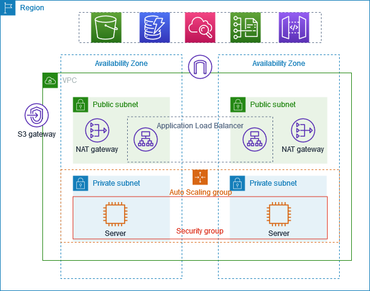

# Secure and Scalable Deployment of Web Applications on AWS

## 📌 Project Overview

This project demonstrates the deployment of a web application on Amazon Web Services (AWS) using Linux-based Amazon EC2 instances and Amazon VPC networking.

The project focuses on understanding how cloud infrastructure can be designed and configured to provide secure access, network isolation, traffic distribution, and basic monitoring.

This project was developed as part of a technical seminar and includes both theoretical concepts and a hands-on AWS implementation.

---

## 🎯 Objectives

* Understand the fundamentals of cloud computing and AWS.
* Deploy a web application using a Linux-based EC2 instance.
* Create and configure a custom VPC.
* Configure public and private subnets.
* Configure Internet Gateway and route tables.
* Implement secure access using Security Groups and IAM.
* Configure an Application Load Balancer (ALB) for traffic distribution.
* Monitor the deployed infrastructure using AWS CloudWatch.
* Gain practical experience with AWS cloud infrastructure.

---

## ☁️ AWS Services Used

| AWS Service               | Purpose                                                   |
| ------------------------- | --------------------------------------------------------- |
| Amazon EC2                | Hosts the web application on a Linux-based virtual server |
| Amazon VPC                | Provides an isolated virtual network                      |
| Internet Gateway          | Provides internet connectivity for the VPC                |
| Route Tables              | Controls traffic routing within the VPC                   |
| Security Groups           | Controls inbound and outbound traffic                     |
| AWS IAM                   | Manages secure access and permissions                     |
| Application Load Balancer | Distributes incoming application traffic                  |
| Amazon CloudWatch         | Provides basic monitoring of the deployed resources       |

---

## 🏗️ Architecture

The project uses AWS networking components including a custom VPC, public and private subnets, an Internet Gateway, route tables, EC2 and an Application Load Balancer.

The architecture is designed to separate internet-facing components from application resources and provide controlled network access.

### Architecture Components

* Custom VPC
* Public Subnets
* Private Subnets
* Internet Gateway
* Route Tables
* Linux-based EC2
* Application Load Balancer
* Security Groups
* IAM
* CloudWatch

---

### AWS Architecture Diagram

## 🚀 Implementation

### 1. EC2 Deployment

A static web application was deployed on an Ubuntu-based Amazon EC2 instance.

### 2. VPC Configuration

A custom VPC was created with public and private subnets to provide network isolation and controlled communication.

### 3. Internet Gateway

An Internet Gateway was configured to provide external connectivity for resources that require internet access.

### 4. Route Tables

Route tables were configured to control traffic between the subnets and provide the required internet connectivity.

### 5. Security Groups

Security Groups were configured to control network traffic and provide secure access to the deployed resources.

### 6. IAM

IAM roles and permissions were configured to provide controlled access to AWS resources.

### 7. Application Load Balancer

An Application Load Balancer was configured to distribute incoming application traffic.

### 8. CloudWatch

AWS CloudWatch was enabled for basic monitoring of the deployed infrastructure and application performance.

---

## 🔐 Security

The project incorporates several AWS security mechanisms:

* VPC network isolation
* Security Groups
* IAM roles and permissions
* Private subnets
* Controlled routing
* Restricted network access

These components help reduce unnecessary exposure of application resources to the public internet.

---

## 📸 Screenshots

Screenshots of the AWS implementation will be added to this repository to demonstrate the configuration and deployment process.

Planned screenshots include:

* VPC configuration
* Subnets
* Route tables
* EC2 instance
* Security Groups
* IAM
* Application Load Balancer
* CloudWatch
* Deployed web application

---

## 🎥 Project Demonstration

A complete demonstration of the AWS implementation is available through the project demo video.

**Demo video:**
[Watch the AWS Project Demonstration](YOUR_VIDEO_LINK)

> The demonstration video covers the practical AWS implementation performed as part of this project.

---

## 📚 What I Learned

Through this project, I gained hands-on experience with:

* AWS cloud infrastructure
* VPC networking
* Public and private subnets
* EC2 and Linux-based server deployment
* Route tables and Internet Gateway
* AWS Security Groups
* IAM
* Application Load Balancer
* CloudWatch monitoring
* Basic cloud security and infrastructure design

---

## 🔮 Future Improvements

The following improvements can be explored in future versions:

* Enable HTTPS using AWS Certificate Manager.
* Automate infrastructure setup using Bash scripts.
* Implement CI/CD using GitHub Actions or AWS CodeDeploy.
* Explore serverless deployment using AWS Lambda and API Gateway.

---

## 📄 Documentation

The complete seminar presentation and theoretical discussion are available in:

**`cloudseminar.pdf`**

The presentation covers cloud computing fundamentals, AWS concepts, deployment models, AWS services, architecture, implementation, demonstration review, conclusion, and future work.

---

## 👩‍💻 Author

**Adithya Raj**

B.Tech Computer Science and Engineering
College of Engineering Munnar
