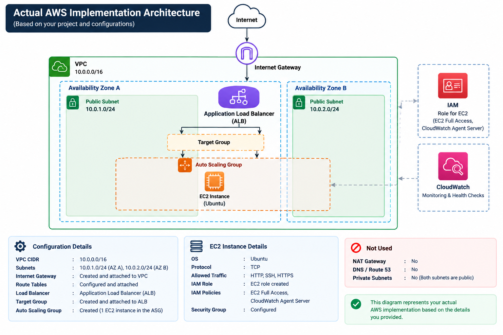

# Secure and Scalable Deployment of Web Applications on AWS

## 📌 Project Overview

This project demonstrates the deployment of a web application on Amazon Web Services (AWS) using a Linux-based Amazon EC2 instance and Amazon VPC networking.

The project focuses on understanding how cloud infrastructure can be designed and configured to provide secure access, network connectivity, traffic distribution, and basic monitoring.

This project was developed as part of a technical seminar and includes both theoretical concepts and a hands-on AWS implementation.

---

## 🎯 Objectives

- Understand the fundamentals of cloud computing and AWS.
- Deploy a web application using a Linux-based EC2 instance.
- Create and configure a custom VPC.
- Configure subnets, route tables, and an Internet Gateway.
- Implement secure access using Security Groups and IAM.
- Configure an Application Load Balancer (ALB) for application traffic.
- Configure an Auto Scaling Group.
- Monitor the deployed infrastructure using Amazon CloudWatch.
- Gain practical experience with AWS cloud infrastructure and networking.

---

## ☁️ AWS Services Used

| AWS Service | Purpose |
|---|---|
| Amazon EC2 | Hosts the web application on an Ubuntu Linux server |
| Amazon VPC | Provides an isolated virtual network |
| Internet Gateway | Provides internet connectivity for the VPC |
| Route Tables | Controls network traffic routing |
| Security Groups | Controls inbound and outbound network traffic |
| AWS IAM | Manages access and permissions |
| Application Load Balancer | Handles and distributes incoming application traffic |
| Auto Scaling | Provides automated management of EC2 capacity |
| Amazon CloudWatch | Provides monitoring of the deployed infrastructure |

---

## 🏗️ Architecture

### AWS Reference Architecture

The following diagram represents the general AWS reference architecture discussed in the seminar.

### Actual AWS Implementation Architecture

The following diagram represents the AWS infrastructure that was actually configured and demonstrated as part of this project.

### Implemented Components

- Amazon VPC with CIDR `10.0.0.0/16`
- Two subnets:
  - `10.0.1.0/24`
  - `10.0.2.0/24`
- Availability Zones
- Internet Gateway
- Route Tables
- Ubuntu-based EC2 instance
- Application Load Balancer (ALB)
- Target Group
- Auto Scaling Group
- Security Groups
- IAM Role for EC2
- Amazon CloudWatch

### Not Used

- NAT Gateway
- DNS / Route 53

---

## 🚀 Implementation

### 1. EC2 Deployment

A static web application was deployed on an Ubuntu-based Amazon EC2 instance.

The EC2 instance was configured with the required network access and security settings for hosting the application.

### 2. VPC Configuration

A custom VPC was created using the CIDR block:

`10.0.0.0/16`

Two subnets were configured:

- `10.0.1.0/24`
- `10.0.2.0/24`

The subnets were associated with Availability Zones to provide the required network infrastructure for the deployment.

### 3. Internet Gateway

An Internet Gateway was created and attached to the custom VPC to provide internet connectivity.

### 4. Route Tables

Route tables were configured to control network traffic and provide the required connectivity between the VPC resources and the internet.

### 5. Security Groups

Security Groups were configured to control network traffic to the EC2 instance and application.

The configured traffic included:

- SSH
- HTTP
- HTTPS
- TCP-based application traffic

### 6. IAM

An IAM role was created for the EC2 instance to provide controlled access to AWS services.

The IAM configuration included permissions related to:

- EC2
- CloudWatch monitoring

### 7. Application Load Balancer

An Application Load Balancer (ALB) was configured to handle incoming application traffic.

A Target Group was created and associated with the application infrastructure.

### 8. Auto Scaling

An Auto Scaling Group was created as part of the AWS infrastructure configuration.

This provides the foundation for automatically managing EC2 capacity based on the configured scaling settings.

### 9. CloudWatch Monitoring

Amazon CloudWatch was configured to monitor the deployed infrastructure and observe the health and performance of the application environment.

---

## ✨ Project Highlights

- Designed and configured a custom Amazon VPC using CIDR `10.0.0.0/16`.
- Created two subnets across Availability Zones.
- Configured an Internet Gateway and route tables.
- Deployed a static web application on an Ubuntu-based EC2 instance.
- Configured Security Groups for controlled network access.
- Created an IAM role for the EC2 instance.
- Configured an Application Load Balancer and Target Group.
- Created an Auto Scaling Group.
- Configured Amazon CloudWatch for monitoring.
- Gained practical experience with AWS networking and cloud infrastructure.

---

## 🛠️ Technologies & AWS Services

**Cloud Platform:**  
Amazon Web Services (AWS)

**AWS Services:**

- Amazon VPC
- Amazon EC2
- Application Load Balancer
- Auto Scaling
- IAM
- Amazon CloudWatch
- Internet Gateway
- Route Tables
- Security Groups

**Operating System:**  
Ubuntu Linux

**Networking:**

- IPv4
- TCP
- HTTP
- HTTPS
- SSH

---

## 🔐 Security

The project incorporates several AWS security mechanisms:

- VPC network isolation
- Security Groups
- IAM roles and permissions
- Controlled routing
- Restricted network access

Security Groups were configured to allow only the required types of traffic for accessing and testing the deployed application.

---

## 📸 Screenshots

The AWS implementation can be demonstrated through the project demonstration video.

Potential screenshots for documenting the implementation include:

- VPC configuration
- Subnets
- Route tables
- EC2 instance
- Security Groups
- IAM role
- Application Load Balancer
- Target Group
- Auto Scaling Group
- CloudWatch
- Deployed web application

---

## 🎥 Project Demonstration

A complete demonstration of the AWS implementation is available through the project demo video.

**Demo Video:**

[Watch the AWS Project Demonstration](https://youtu.be/9URUkkw36hk)

> The demonstration video covers the practical AWS implementation performed as part of this project.

---

## 📚 What I Learned

Through this project, I gained hands-on experience with:

- AWS cloud infrastructure
- VPC networking
- IPv4 networking
- Subnets and Availability Zones
- EC2 and Linux-based server deployment
- Route tables and Internet Gateway
- AWS Security Groups
- IAM roles and permissions
- Application Load Balancer
- Target Groups
- Auto Scaling
- CloudWatch monitoring
- Basic cloud security and infrastructure design

---

## 🔮 Future Improvements

The following improvements can be explored in future versions:

- Enable HTTPS using AWS Certificate Manager.
- Automate infrastructure setup using Bash scripts.
- Implement CI/CD using GitHub Actions or AWS CodeDeploy.
- Explore serverless deployment using AWS Lambda and API Gateway.

---

## 📄 Documentation

The complete seminar presentation and theoretical discussion are available in:

**`cloudseminar.pdf`**

The presentation covers cloud computing fundamentals, AWS concepts, deployment models, AWS services, architecture, implementation, demonstration review, conclusion, and future work.

---

## 👩‍💻 Author

**Adithya Raj**

B.Tech Computer Science and Engineering  
College of Engineering Munnar
